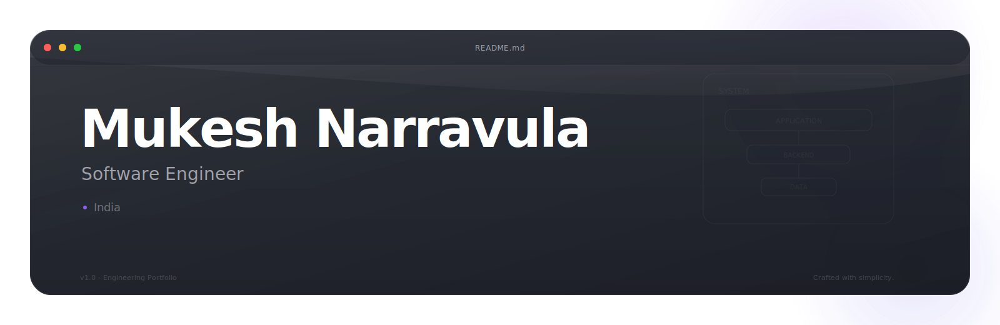

<!-- 

   -->

# Mukesh Narravula

**Backend Engineer · Developer Tooling · Applied ML**

 

 

---

 

## About

I build software that is reliable, maintainable, and designed to evolve.

My work centers on backend engineering, developer tooling, and full‑stack systems — with a growing focus on distributed systems, systems programming, and applied machine learning. I care more about thoughtful architecture than clever complexity. Software should be easy to reason about, simple to maintain, and ready to scale when it needs to.

 

 

---

 

## Engineering Environment

*The workspace, tools, and technologies behind my daily engineering workflow.*

 

<table>
<tr>

<td width="33%" valign="top">

### 💻 Workspace

</td>

<td width="33%" valign="top">

### ⚙️ Toolchain

</td>

<td width="33%" valign="top">

### 🎯 Focus

</td>

</tr>
</table>

  

### Core Technologies

  

Building scalable backend systems, developer tooling, and modern full-stack applications.

 

---

 

## Featured Projects

<strong>Explore My Featured Projects</strong>

 

### FinCheck

**Confidence-Aware Cheque Validation**

An uncertainty-aware deep learning system for automated cheque verification, designed to improve prediction confidence and reduce false decisions through reliable model inference.

`Next.js` · `FastAPI` · `PyTorch` · `MongoDB`

<a href="https://github.com/fincheck-labs/fincheck-next">View Repository</a>
&nbsp;·&nbsp;
<a href="https://fincheck-next.vercel.app/">Launch Demo</a>

---

### Smart Canteen Management System

**Data-Driven Campus Operations**

A full-stack canteen management platform that streamlines daily operations while integrating predictive analytics through scalable backend services.

`Next.js` · `FastAPI` · `Python` · `MongoDB`

<a href="https://github.com/mukesh1352/canteensmart">View Repository</a>
&nbsp;·&nbsp;
<a href="https://canteensmart.vercel.app/">Launch Demo</a>

---

### Go Jupyter Notebook Runner

**Developer Tooling**

A lightweight command-line utility for executing Python scripts and Jupyter notebooks through a Go-based runtime.

`Go` · `Python`

<a href="https://github.com/mukesh1352/go_jupyter_converter">View Repository</a>

---

### PlagCheck

**High-Performance Text Comparison**

A plagiarism detection engine built in Rust using the Myers Difference Algorithm for efficient and accurate textual comparison.

`Rust` · `Myers Diff`

<a href="https://github.com/mukesh1352/PlagCheck">View Repository</a>

---

### Auction Socket

**Real-Time Auction Platform**

An asynchronous auction platform supporting concurrent bidding through persistent WebSocket connections and event-driven communication.

`Python` · `AsyncIO` · `WebSockets`

<a href="https://github.com/mukesh1352/auction_socket">View Repository</a>

---

### Fuel-Efficient Pathfinding Engine

**Graph-Based Route Optimization**

A Java-based routing engine that computes fuel-efficient travel paths using classic graph algorithms with a focus on performance and maintainability.

`Python` · `Graph Algorithms` . `Traversals`

<a href="https://github.com/mukesh1352/pathfinding-with-fuel">View Repository</a>
&nbsp;·&nbsp;
<a href="https://pathfinding-with-fuel.onrender.com/">Launch Demo</a>

 

---

 

## Experience

**AP TRANSCO** — Data Science Engineer Intern

Contributed to data science and engineering initiatives for power distribution operations — building ML workflows, automating analytical pipelines, and supporting data‑driven decision making.

 

---

 

## Research

**IEEE Conference**

*An Empirical Comparative Study on Pruning and Quantization Algorithms for Model Compression*

A comparative study of neural network compression techniques, evaluating pruning and quantization approaches to improve inference efficiency while preserving predictive performance.

 

---

 

## GitHub Activity

<!-- 

 -->

  

 

---

## Principles

> Build for clarity before cleverness.
>
> Measure before optimizing.
>
> Keep systems modular.
>
> Automate repetitive work.
>
> Never stop learning.
---

 

### Let's connect

Open to conversations about backend development, developer tools, and collaboration.

 

  

Designed with simplicity. Built with curiosity.

